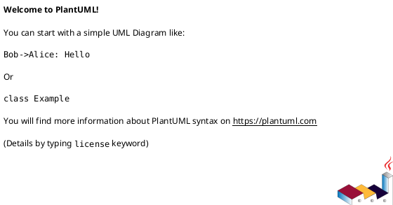
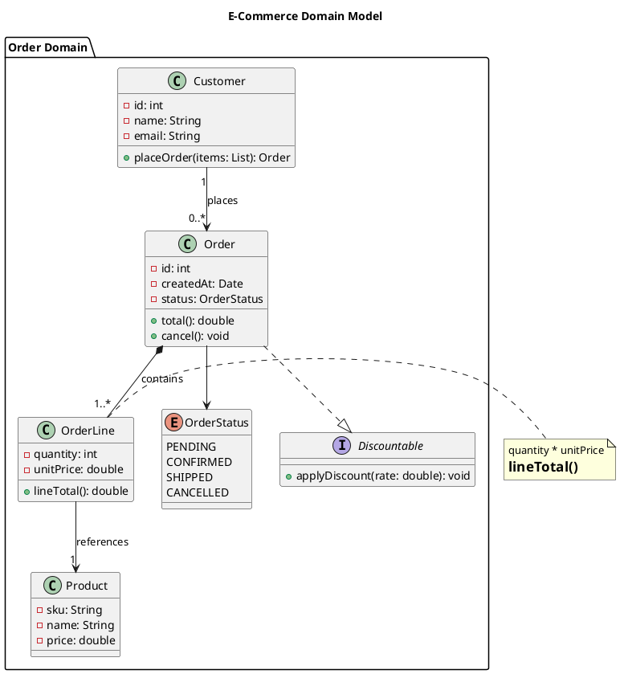

# PlantUML Class Diagram Cheat Sheet

Class diagrams model the **static structure** of a system — the "things" that exist, what data they hold, and how they relate to each other. Use them when you want to communicate how your code is organized, not how it behaves over time.

---

## Basic File Structure

Every PlantUML file is wrapped in `@startuml` / `@enduml`:



---

## Classes

### Defining a Class

```plantuml
class Animal {
  - name: String
  - age: int
  + getName(): String
  + makeSound(): void
}
```

**Why:** A `class` represents a blueprint for objects — the nouns in your system. Use it when you have a concept with both data (fields) and behavior (methods).

### Visibility Modifiers

| Symbol | Meaning     | Use when...                                          |
|--------|-------------|------------------------------------------------------|
| `+`    | public      | anything outside the class can use it                |
| `-`    | private     | only this class can use it                           |
| `#`    | protected   | this class and its subclasses can use it             |
| `~`    | package     | classes in the same package can use it               |

**Why:** Visibility communicates the intended API surface of your class. It tells readers "here's what I'm exposing" vs. "here's implementation detail."

### Abstract Classes

```plantuml
abstract class Shape {
  + area(): double
  + draw(): void
}
```

**Why:** Use `abstract` when you have a concept that shouldn't be instantiated directly — it defines a contract that subclasses must fulfill. For example, `Shape` makes no sense on its own; you always need a `Circle` or `Rectangle`.

### Interfaces

```plantuml
interface Printable {
  + print(): void
  + getPageCount(): int
}
```

**Why:** Interfaces define a pure contract with no implementation. Use them to express that unrelated classes share a capability (e.g., both `Invoice` and `Report` can be `Printable`).

### Enumerations

```plantuml
enum Status {
  PENDING
  ACTIVE
  CLOSED
}
```

**Why:** Enums represent a fixed set of named values. Use them instead of magic strings or integers when a field can only be one of a known set of options.

---

## Relationships

Relationships are the heart of a class diagram — they show how your classes connect and depend on each other.

### Inheritance (Generalization)

```plantuml
Animal <|-- Dog
Animal <|-- Cat
```

Arrow: `<|--` (hollow triangle pointing at the parent)

**What it means:** "Dog IS-A Animal." The child class inherits all the parent's fields and methods and can override behavior.

**Why you draw it:** When two classes share common structure and behavior, inheritance avoids duplication. In UML, it says "this is a specialization of that."

### Interface Implementation (Realization)

```plantuml
Printable <|.. Invoice
Printable <|.. Report
```

Arrow: `<|..` (dashed hollow triangle)

**What it means:** "Invoice implements the Printable interface." The class fulfills the contract defined by the interface.

**Why you draw it:** Shows which classes provide a particular capability, without implying they share structure.

### Association

```plantuml
Customer --> Order
```

Arrow: `-->` (plain arrow)

**What it means:** "Customer has a reference to Order." One class knows about and uses another.

**Why you draw it:** This is the most general relationship — use it when one class holds a reference to another as part of normal use, but the two objects have independent lifecycles.

### Aggregation

```plantuml
Team o-- Player
```

Arrow: `o--` (hollow diamond on the "whole" side)

**What it means:** "Team has Players, but Players can exist without the Team." This is a "has-a" relationship where the parts can survive independently.

**Why you draw it:** Distinguishes a loose collection from a tight ownership. A `Team` aggregates `Player`s, but a `Player` isn't destroyed when a `Team` is.

### Composition

```plantuml
House *-- Room
```

Arrow: `*--` (filled diamond on the "whole" side)

**What it means:** "House owns Rooms. If the House is destroyed, the Rooms are too." The parts cannot exist without the whole.

**Why you draw it:** Models strong ownership and lifecycle coupling. A `Room` only makes sense as part of a `House`.

### Dependency

```plantuml
OrderService ..> EmailService
```

Arrow: `..>` (dashed arrow)

**What it means:** "`OrderService` uses `EmailService`, but doesn't hold a permanent reference to it" — e.g., it's passed as a method parameter or created temporarily.

**Why you draw it:** Shows a weaker coupling than association. Useful for flagging that a change in `EmailService` might break `OrderService`.

### Relationship Summary Table

| Relationship    | Arrow    | Meaning                          | Lifecycle        |
|-----------------|----------|----------------------------------|------------------|
| Inheritance     | `<|--`   | IS-A                             | —                |
| Realization     | `<|..`   | implements interface             | —                |
| Association     | `-->`    | has a reference to               | independent      |
| Aggregation     | `o--`    | has, loosely                     | parts independent|
| Composition     | `*--`    | owns, tightly                    | parts die with whole |
| Dependency      | `..>`    | uses temporarily                 | independent      |

---

## Labels and Multiplicity

### Adding Labels to Relationships

```plantuml
Customer "1" --> "0..*" Order : places
```

**Why:** Labels clarify *how many* and *what role* each side plays. `"1"` to `"0..*"` means "one customer places zero or more orders."

### Common Multiplicity Notations

| Notation | Meaning           |
|----------|-------------------|
| `1`      | exactly one       |
| `0..1`   | zero or one       |
| `*`      | zero or more      |
| `1..*`   | one or more       |
| `2..5`   | between 2 and 5   |

---

## Packages and Namespaces

```plantuml
package "com.example.model" {
  class User
  class Product
}

package "com.example.service" {
  class UserService
  class ProductService
}

UserService --> User
```

**Why:** Packages group related classes and show module boundaries. They communicate architectural layering (e.g., model vs. service vs. controller).

---

## Notes and Comments

```plantuml
class Order {
  + total(): double
}

note right of Order : "This should\nuse a Money type"

note "Shared note" as N1
Order .. N1
```

**Why:** Notes let you annotate decisions, caveats, or questions directly on the diagram — useful during design reviews.

PlantUML line comments use `'`:

```plantuml
' This is a comment
```

---

## Hiding and Styling

### Hide Members

```plantuml
hide members
show Order members
```

**Why:** Useful for high-level overview diagrams where you want to show structure without drowning in field/method detail.

### Skinparam (Basic Styling)

```plantuml
skinparam classBackgroundColor LightYellow
skinparam classBorderColor DarkGray
skinparam classArrowColor Navy
```

---

## Full Example



---

## Quick Reference Card

```
Class types       class  /  abstract class  /  interface  /  enum
Visibility        +public  -private  #protected  ~package
Relationships     <|--  inheritance    <|..  realization
                  -->   association    o--   aggregation
                  *--   composition    ..>   dependency
Multiplicity      "1"  "0..1"  "*"  "1..*"
Grouping          package "name" { }
Notes             note right of ClassName : text
Comments          ' single-line comment
```
