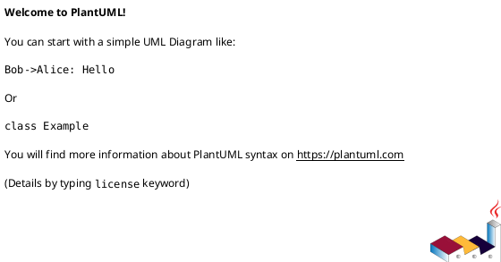

# PlantUML Deployment Diagram Cheat Sheet

Deployment diagrams model the **physical structure** of a system — where software actually runs, on what hardware or infrastructure, and how those pieces connect. Where class diagrams show code structure and sequence diagrams show runtime behavior, deployment diagrams answer: "What is running where, and how does it talk to everything else?"

Use them when you want to communicate infrastructure topology, hosting decisions, network boundaries, or how components are distributed across environments.

---

## Basic File Structure



---

## Nodes

Nodes are the physical or virtual things that host software — servers, containers, devices, or cloud services.

### Defining a Node

```plantuml
node "Web Server" {
}

node "Database Server" {
}
```

**Why:** A `node` represents anything that can execute or host software — a physical machine, a VM, a container, a cloud instance. It's the foundation of a deployment diagram.

### Node Types

Different keywords render with different visual shapes:

```plantuml
node        "App Server"
device      "Load Balancer"
cloud       "AWS Cloud"
database    "PostgreSQL"
component   "Auth Service"
artifact    "app.war"
```

| Keyword     | Shape          | Use for...                                        |
|-------------|----------------|---------------------------------------------------|
| `node`      | 3D box         | servers, VMs, containers, execution environments  |
| `device`    | 3D box variant | physical hardware, network appliances             |
| `cloud`     | cloud shape    | cloud provider regions or services                |
| `database`  | cylinder       | database servers or managed database services     |
| `component` | component box  | software components or services within a node     |
| `artifact`  | document shape | deployable files — JARs, WARs, Docker images      |

**Why:** Choosing the right keyword communicates the *nature* of each element at a glance. A `cloud` immediately tells the reader "this is a managed service," while a `node` says "this is a compute instance."

---

## Artifacts

Artifacts are the deployable units of software — the actual files or packages that get installed and run on a node.

```plantuml
node "App Server" {
  artifact "api-service.jar"
}

node "Web Server" {
  artifact "frontend.zip"
}
```

**Why:** Artifacts make deployment concrete — they link abstract "services" to the actual deliverable that ops teams install. Showing which artifact lands on which node clarifies the deployment process.

### Artifact with Stereotype

```plantuml
artifact "user-service" <<Docker Image>>
artifact "nginx.conf" <<config>>
```

Stereotypes (in `<<...>>`) add a label that clarifies the type of artifact.

---

## Nesting (Containment)

Nodes can be nested inside other nodes to show containment — a service inside a container, a container inside a VM, a VM inside a cloud region.

```plantuml
cloud "AWS" {
  node "us-east-1" {
    node "EC2 Instance" {
      artifact "api-service.jar"
    }
    database "RDS PostgreSQL"
  }
}
```

**Why:** Nesting communicates physical and logical containment without adding extra arrows. It immediately conveys "this runs inside that," which is essential for cloud infrastructure diagrams.

---

## Connections

Connections show how nodes and components communicate.

### Basic Connection

```plantuml
node "Web Server" --> node "App Server"
```

Arrow: `-->` (plain arrow)

**What it means:** The Web Server sends requests to the App Server.

### Labeled Connection (Protocol / Port)

```plantuml
"Web Server" --> "App Server" : HTTPS :8443
"App Server" --> "Database" : JDBC :5432
```

**Why:** Labels on connections are critical in deployment diagrams — they tell you *how* things talk, not just *that* they talk. Protocol and port information is essential for firewall rules, security reviews, and debugging.

### Bidirectional Connection

```plantuml
"Service A" <--> "Service B" : gRPC
```

**Why:** Use bidirectional arrows when both sides initiate communication — common in peer-to-peer or bidirectional sync scenarios.

### Dependency (Dashed)

```plantuml
"Auth Service" ..> "Config Server" : reads config
```

Arrow: `..>` (dashed)

**What it means:** A weaker or indirect dependency — the Auth Service relies on Config Server but doesn't call it in the main request path.

### Connection Style Reference

| Arrow  | Meaning                             | When to use                            |
|--------|-------------------------------------|----------------------------------------|
| `-->`  | directed connection                 | one-way request/response               |
| `<-->` | bidirectional                       | both sides initiate                    |
| `..>`  | dashed dependency                   | indirect or startup-time dependency    |
| `--`   | undirected link                     | network link with no single initiator  |

---

## Components Inside Nodes

You can place `component` elements inside nodes to show what software runs there.

```plantuml
node "App Server" {
  component "Order Service"
  component "Inventory Service"
  component "Auth Middleware"
}
```

**Why:** When a single node runs multiple services or processes, listing them as components inside the node makes it clear what's co-located — which matters for resource contention, failure isolation, and deployment coupling.

### Components with Interfaces

```plantuml
node "API Gateway" {
  component "Gateway" as GW
  interface "REST API" as API
  GW - API
}

"Mobile Client" --> API : HTTPS
```

**Why:** Exposing an interface on a component shows the explicit surface area that other nodes connect to — the published contract, not the implementation.

---

## Network Zones and Boundaries

Use `rectangle` or nesting to represent network zones, firewalls, or security boundaries.

```plantuml
rectangle "DMZ" {
  node "Load Balancer"
  node "Web Server"
}

rectangle "Private Subnet" {
  node "App Server"
  database "PostgreSQL"
}

rectangle "External" {
  actor "User"
}

"User" --> "Load Balancer" : HTTPS
"Load Balancer" --> "Web Server" : HTTP
"Web Server" --> "App Server" : HTTP :8080
"App Server" --> "PostgreSQL" : JDBC :5432
```

**Why:** Network boundaries are one of the most important things to communicate in a deployment diagram — they determine what traffic is allowed, what needs encryption, and what is exposed to the internet. Grouping nodes by zone makes this immediately visible.

---

## Notes and Comments

```plantuml
node "App Server" {
  artifact "api.jar"
}

note right of "App Server" : Auto-scaled 2–10 instances\nbehind ALB

note "Encrypted at rest\nKMS-managed keys" as N1
database "RDS" .. N1
```

| Form                         | Placement                                |
|------------------------------|------------------------------------------|
| `note right of Element`      | right of a specific element              |
| `note left of Element`       | left of a specific element               |
| `note top of Element`        | above a specific element                 |
| `note bottom of Element`     | below a specific element                 |
| `note "text" as N1`          | floating note, linked with `..`          |

**Why:** Notes are essential in deployment diagrams for capturing operational details that don't fit in the diagram structure itself — scaling policies, encryption requirements, SLAs, or "why is this here?" explanations.

PlantUML line comments use `'`:

```plantuml
' This is a comment — not rendered in the diagram
```

---

## Skinparam (Basic Styling)

```plantuml
skinparam nodeBackgroundColor LightBlue
skinparam nodeBorderColor Navy
skinparam artifactBackgroundColor LightYellow
skinparam cloudBackgroundColor AliceBlue
skinparam databaseBackgroundColor LightGreen
```

---

## Full Example

```plantuml
@startuml
title Production Deployment — E-Commerce Platform

skinparam nodeBackgroundColor LightBlue
skinparam cloudBackgroundColor AliceBlue
skinparam databaseBackgroundColor LightGreen

actor "Customer" as User
actor "Admin" as Admin

rectangle "External" {
  User
  Admin
}

cloud "AWS us-east-1" {

  rectangle "DMZ" {
    node "ALB" as ALB <<Load Balancer>> {
    }
    node "Web Server" as WS {
      artifact "frontend.zip"
    }
  }

  rectangle "Private Subnet — App Tier" {
    node "App Server 1" as APP1 {
      component "Order Service" as OS
      component "Auth Service" as AUTH
    }
    node "App Server 2" as APP2 {
      component "Order Service"
      component "Auth Service"
    }
  }

  rectangle "Private Subnet — Data Tier" {
    database "RDS PostgreSQL\n(primary)" as DB
    database "RDS PostgreSQL\n(replica)" as DBR
  }

  node "ElastiCache" as CACHE <<Redis>>
  node "S3 Bucket" as S3 <<Object Storage>>

}

User --> ALB : HTTPS :443
Admin --> WS : HTTPS :443

ALB --> WS : HTTP :80
WS --> APP1 : HTTP :8080
WS --> APP2 : HTTP :8080

APP1 --> DB : JDBC :5432
APP2 --> DB : JDBC :5432
DB --> DBR : replication

APP1 --> CACHE : Redis :6379
APP2 --> CACHE : Redis :6379

APP1 ..> S3 : uploads/downloads
APP2 ..> S3 : uploads/downloads

note right of ALB : Routes traffic across\nApp Server 1 & 2
note bottom of DB : Automated daily snapshots\nMulti-AZ failover enabled
note right of CACHE : Session store +\nproduct catalog cache

@enduml
```

---

## Quick Reference Card

```
Node types       node  device  cloud  database  component  artifact
Grouping         rectangle "Zone" { }   cloud "Provider" { }
Nesting          node "VM" { node "Container" { artifact "app" } }
Connections      -->  directed          <-->  bidirectional
                 ..>  dashed/dependency  --   undirected link
Labels           "A" --> "B" : HTTPS :443
Notes            note right of Element : text
                 note "text" as N1   Element .. N1
Comments         ' single-line comment
```
