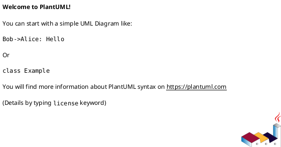

# PlantUML Sequence Diagram Cheat Sheet

Sequence diagrams model **behavior over time** — the "conversations" between parts of your system. Where class diagrams show structure (what exists), sequence diagrams show dynamics (what happens, in what order, and who talks to whom).

Use them when you want to explain a specific scenario: a login flow, an API call chain, a checkout process, an error-handling path.

---

## Basic File Structure



---

## Participants

Participants are the "actors" in your diagram — the things sending and receiving messages.

### Declaring Participants

```plantuml
participant User
participant "Order Service" as OS
participant Database
```

You can declare participants explicitly to control their order (left to right) and give them aliases with `as`.

**Why:** Naming participants clearly sets up who is involved in the scenario before any messages are drawn.

### Participant Types

Different keywords render participants with different visual shapes:

```plantuml
actor       User
boundary    WebForm
control     OrderController
entity      Order
database    OrderDB
collections OrderQueue
participant GenericBox
```

| Keyword       | Shape          | Use for...                                      |
|---------------|----------------|-------------------------------------------------|
| `actor`       | stick figure   | a human user or external system                 |
| `boundary`    | circle+line    | UI elements, APIs, or system boundaries         |
| `control`     | circle+arrow   | controllers, coordinators, use-case logic       |
| `entity`      | circle+line    | domain objects, data models                     |
| `database`    | cylinder       | databases, data stores                          |
| `collections` | double box     | groups of objects (e.g., a list of records)     |
| `participant` | rectangle      | anything else — the generic default             |

**Why:** These shapes are a UML convention for communicating the *role* of each participant at a glance. You don't have to use them, but they make diagrams more expressive.

---

## Messages (Arrows)

Messages are the calls, responses, and signals between participants.

### Synchronous Call (request + waits for response)

```plantuml
User -> OrderService : placeOrder(items)
```

Arrow: `->` (solid line, filled arrowhead)

**What it means:** The sender makes a call and blocks until it gets a response. This is the most common type — a normal method call or HTTP request.

### Return / Response

```plantuml
OrderService --> User : orderId
```

Arrow: `-->` (dashed line)

**What it means:** The response coming back from a call. Use dashed arrows for returns to visually distinguish "going" from "coming back."

**Why:** Pairing a solid call with a dashed return makes it easy to trace the full round-trip of a request.

### Asynchronous Message (fire and forget)

```plantuml
OrderService ->> EmailQueue : sendConfirmationEmail(order)
```

Arrow: `->>` (open arrowhead)

**What it means:** The sender fires the message and moves on without waiting for a response. Typical for events, queues, and async notifications.

### Self-Message (a participant calling itself)

```plantuml
OrderService -> OrderService : validateItems(items)
```

**Why:** Useful for showing internal logic or helper method calls that are significant enough to call out.

### Arrow Style Reference

| Arrow  | Type                        | When to use                              |
|--------|-----------------------------|------------------------------------------|
| `->`   | synchronous call            | normal method calls, blocking HTTP       |
| `-->`  | return / response           | returning from a call                    |
| `->>`  | asynchronous                | queues, events, fire-and-forget          |
| `-->>`  | async return               | async callback or event acknowledgment   |
| `-x`   | lost message                | message sent but no receiver             |
| `o->`  | found message               | message with unknown origin              |

---

## Activation Bars

Activation bars are the tall thin rectangles on a participant's lifeline showing when it is actively executing.

```plantuml
User -> OrderService : placeOrder()
activate OrderService

OrderService -> Database : saveOrder()
activate Database
Database --> OrderService : orderId
deactivate Database

OrderService --> User : orderId
deactivate OrderService
```

**Why:** Activation bars communicate *duration* — when a participant is doing work. They make it easy to see overlapping work, nested calls, and where time is being spent.

Shorthand — use `++` and `--` on the arrows themselves:

```plantuml
User -> OrderService ++ : placeOrder()
  OrderService -> Database ++ : saveOrder()
  Database --> OrderService -- : orderId
OrderService --> User -- : orderId
```

---

## Grouping and Control Flow

### Loop

```plantuml
loop for each item in cart
  OrderService -> Inventory : checkStock(item)
  Inventory --> OrderService : available
end
```

**Why:** Shows that a block of messages repeats. Use it when processing a collection or retrying.

### Alt / Else (conditional branches)

```plantuml
alt payment successful
  PaymentService --> OrderService : success
  OrderService --> User : confirmation
else payment failed
  PaymentService --> OrderService : failure
  OrderService --> User : error message
end
```

**Why:** The most important grouping construct. Models if/else logic — different paths through the scenario. Helps readers understand all the outcomes, not just the happy path.

### Opt (optional block)

```plantuml
opt user has loyalty points
  OrderService -> LoyaltyService : applyPoints(userId)
end
```

**Why:** Like `alt` with only one branch — shows something that *might* happen. Cleaner than `alt` when there's no else case.

### Par (parallel execution)

```plantuml
par
  OrderService -> EmailService : sendConfirmation()
and
  OrderService -> InventoryService : reserveItems()
end
```

**Why:** Shows that two things happen concurrently, not sequentially. Important for performance-sensitive or event-driven flows.

### Break

```plantuml
break item out of stock
  OrderService --> User : "Item unavailable"
end
```

**Why:** Models an early exit from a sequence — an exception or guard condition that stops normal processing.

### Critical

```plantuml
critical
  OrderService -> Database : updateInventory()
end
```

**Why:** Marks a block that must not be interrupted — a transaction, a lock, or an atomic operation.

### Ref (reference to another diagram)

```plantuml
ref over User, OrderService
  See Authentication Flow
end
```

**Why:** Keeps large diagrams manageable by referencing sub-flows defined elsewhere.

---

## Lifelines and Participant Lifecycle

### Creating a Participant Mid-Sequence

```plantuml
OrderService -> Order ** : create()
```

`**` creates the participant at that point in the sequence (shown with a "create" box).

**Why:** Models object instantiation — the `Order` object doesn't exist until it's explicitly created.

### Destroying a Participant

```plantuml
OrderService -> TempSession !! : destroy()
```

`!!` marks the end of a participant's lifeline with an X.

**Why:** Models explicit destruction or cleanup of a resource.

---

## Notes and Comments

```plantuml
User -> OrderService : placeOrder()
note right : This triggers the\nfull order workflow

note over OrderService, Database : Both must succeed\nor we rollback
```

| Form                          | Placement                              |
|-------------------------------|----------------------------------------|
| `note left`                   | left of the most recent arrow          |
| `note right`                  | right of the most recent arrow         |
| `note over Participant`       | centered on one participant's lifeline |
| `note over P1, P2`            | spanning multiple lifelines            |

**Why:** Notes let you annotate business rules, assumptions, or non-obvious decisions directly on the diagram.

PlantUML line comments use `'`:

```plantuml
' This is a comment — not rendered in the diagram
```

---

## Dividers and Spacing

```plantuml
== Initialization ==

User -> OrderService : placeOrder()

== Processing ==

OrderService -> PaymentService : charge()
```

`==` creates a visual divider with a label — useful for separating phases of a long flow.

```plantuml
|||
```

`|||` adds extra vertical space between messages.

---

## Autonumbering

```plantuml
autonumber

User -> OrderService : placeOrder()
OrderService -> Database : saveOrder()
Database --> OrderService : id
OrderService --> User : orderId
```

**Why:** Numbered steps make it easy to reference specific messages in documentation or code reviews ("see step 3").

You can also format: `autonumber "<b>[000]</b>"` for bold zero-padded numbers.

---

## Skinparam (Basic Styling)

```plantuml
skinparam sequenceArrowThickness 2
skinparam sequenceParticipantBackgroundColor LightBlue
skinparam sequenceLifeLineBorderColor Gray
skinparam sequenceGroupBorderColor DarkOrange
```

---

## Full Example

```plantuml
@startuml
title Place Order — Happy Path

autonumber

actor User
boundary "Web UI" as UI
control OrderController
entity Order
database OrderDB
participant PaymentService
participant EmailService

User -> UI : submits cart
UI -> OrderController : POST /orders

activate OrderController

OrderController -> Order ** : create(cartItems)
activate Order

loop for each item
  Order -> OrderDB : checkInventory(item)
  OrderDB --> Order : stockLevel
end

alt all items in stock
  Order -> PaymentService : charge(user, total)
  activate PaymentService
  PaymentService --> Order : paymentConfirmed
  deactivate PaymentService

  Order -> OrderDB : save()
  OrderDB --> Order : orderId

  OrderController --> UI : 201 Created (orderId)
  UI --> User : "Order confirmed!"

  Order -> EmailService : sendConfirmation(user, orderId)

else item out of stock
  Order !!
  OrderController --> UI : 409 Conflict
  UI --> User : "Sorry, item unavailable"
end

deactivate Order
deactivate OrderController

note over EmailService : Sent asynchronously —\nuser doesn't wait for this
@enduml
```

---

## Quick Reference Card

```
Participant types   actor  boundary  control  entity  database  collections  participant
Message arrows      ->   synchronous call       -->  return/response
                    ->>  asynchronous           -x   lost message
Activation          activate / deactivate       ++ / -- shorthand
Grouping            loop [condition]            alt / else / end
                    opt [condition]             par / and / end
                    break / critical / ref
Lifecycle           ->  Obj **  : create        ->  Obj !!  : destroy
Notes               note left / right           note over P1, P2
Dividers            == Section Label ==         ||| (extra space)
Autonumber          autonumber
```
